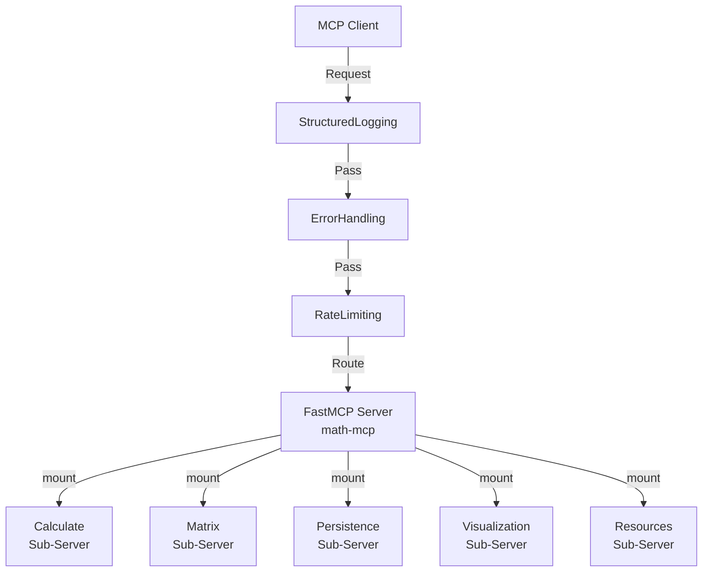
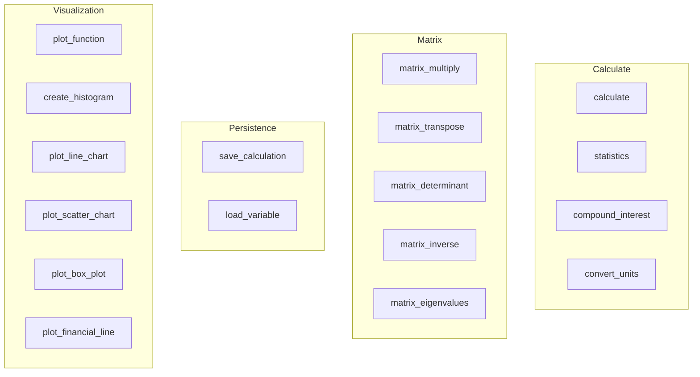
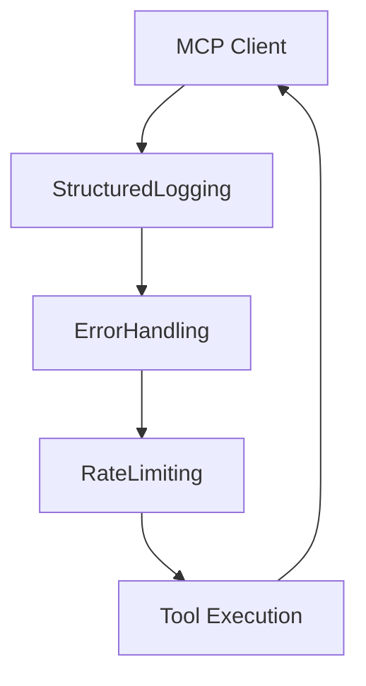
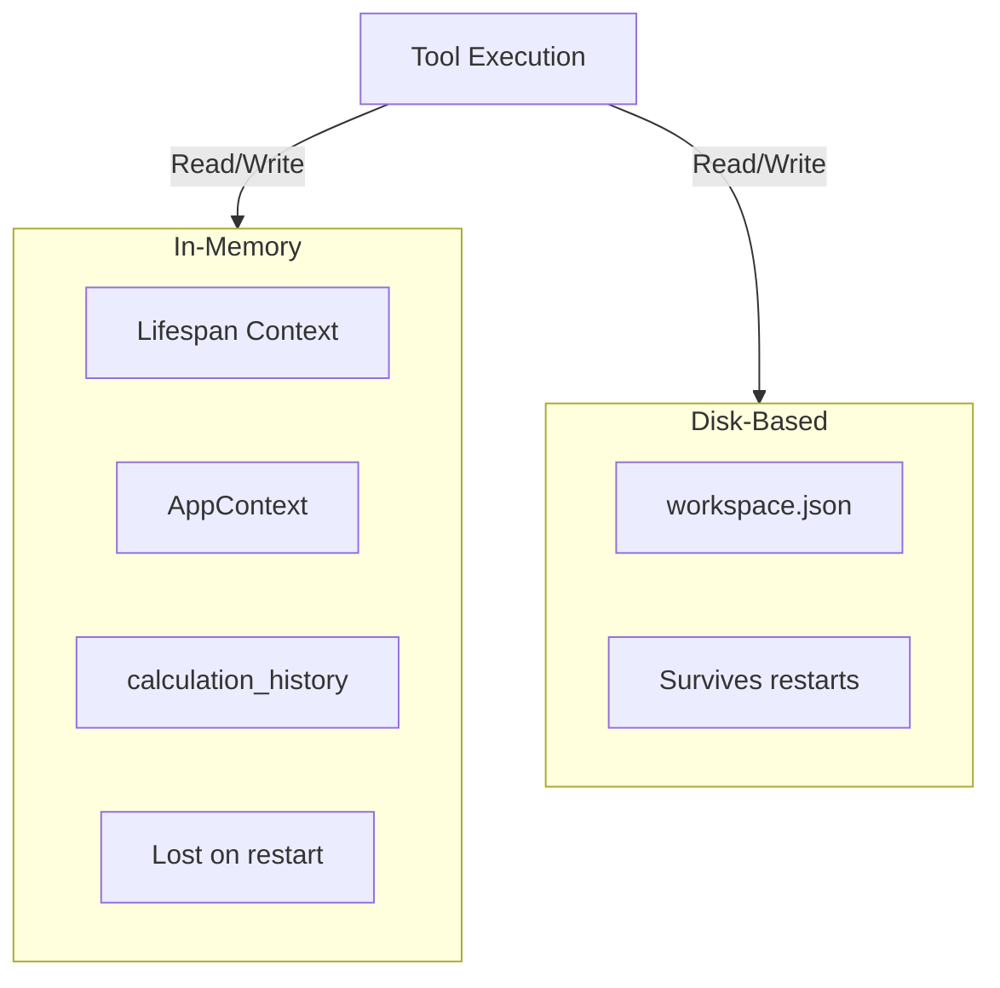

# Architecture

Math MCP Server is a modular FastMCP 3.0 application composed of five mounted sub-servers (calculate, matrix, persistence, visualization, resources) with a three-layer middleware stack (StructuredLogging, ErrorHandling, RateLimiting). State is managed across two layers: in-memory lifespan context for session data and persistent workspace files for cross-session recovery.

## Component Map

## Tool Taxonomy

## Request Lifecycle

## State Layers

## Design Principles

- **KISS (Keep It Simple, Stupid)**: Single-file tools, minimal dependencies, no over-engineering. Each tool does one thing well.
- **Educational Clarity**: Code is a teaching artifact. Comments explain "why", not "what". Docstrings include examples and difficulty annotations.
- **Security First**: Restricted `eval()` scope (math module + abs only), Pydantic validation on all inputs, no arbitrary code execution.
- **Modular Composition**: FastMCP's mount pattern enables independent sub-servers with shared middleware; easy to test, extend, or disable.

## FastMCP 3.0 Patterns

- **Composition via Mount**: Each tool category (calculate, matrix, persistence, visualization) is a separate FastMCP instance mounted into the root server. Enables independent development and testing.
- **Middleware Stack**: Three layers (StructuredLogging → ErrorHandling → RateLimiting) applied once at the root level; all mounted sub-servers inherit them automatically.
- **Lifespan Context**: `@asynccontextmanager` in server.py manages AppContext (in-memory state) across the server lifetime. Lost on restart; use workspace persistence for recovery.
- **Optional Context**: All tools accept `ctx: SkipValidation[Context | None] = None` (never required). Guarded with `if ctx:` before use; enables tools to work with or without MCP runtime context.

## Prompts

FastMCP's `@mcp.prompt()` decorator registers reusable prompt templates that Claude can invoke. Math MCP Server provides two prompts via the resources sub-server: `math_tutor` (structured tutoring prompts with configurable difficulty and examples) and `formula_explainer` (detailed formula breakdowns with variable definitions, context, and real-world applications). See [FastMCP Prompts Documentation](https://gofastmcp.com/servers/prompts) for details.

## Architecture Decision Records

| ADR | Title | Status |
|-----|-------|--------|
| [ADR-001](adr/001-eval-sandbox.md) | Restricted eval() Sandbox | Accepted |
| [ADR-002](adr/002-monolith-decomposition.md) | Monolith-then-Modules Decomposition | Accepted |
| [ADR-003](adr/003-fastmcp-3-upgrade.md) | FastMCP 3.0 Early Adoption | Accepted |
| [ADR-004](adr/004-asyncio-to-thread.md) | asyncio.to_thread() over ProcessPoolExecutor | Accepted |
| [ADR-005](adr/005-pydantic-validation.md) | Pydantic + @validated_tool for Input Validation | Accepted |
| [ADR-006](adr/006-matplotlib-agg.md) | Matplotlib + Agg Backend for Visualization | Accepted |
| [ADR-007](adr/007-json-workspace-persistence.md) | JSON Files for Workspace Persistence | Accepted |

## Development Workflow

See [CONTRIBUTING.md](../CONTRIBUTING.md) for feature branch process, commit standards, testing requirements, and PR review guidelines.
